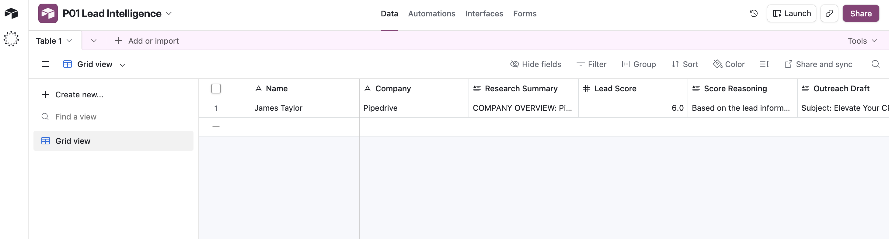

# Project 01 — Multi-Agent Lead Intelligence System

Automates lead research, scoring, personalised outreach, and CRM updates using a multi-agent n8n pipeline.

**Status:** Complete — fully tested end-to-end

**Stack:** n8n, OpenAI GPT-4o, Claude Sonnet, PostgreSQL, pgvector, Tavily, Airtable

## Documentation

- [Architecture Design](docs/architecture.md) — full system design, agent details, data flow, tech decisions
- [Architecture Diagram](docs/architecture.excalidraw) — visual diagram (open in Excalidraw or VS Code Excalidraw extension)

## Architecture Overview

```
Lead Input → Orchestrator (GPT-4o)
                 ↓
         Research Agent (GPT-4o-mini + Tavily)
                 ↓ → Postgres
         Scoring Agent (Claude Sonnet + RAG)
                 ↓ → Postgres
         Personalisation Agent (GPT-4o)
                 ↓ → Postgres
         ⏸ HITL Approval Gate
                 ↓
         CRM Agent → HubSpot/Airtable
```

**Key patterns:** Multi-agent orchestration, Postgres shared state bus, RAG via pgvector, multi-LLM routing, human-in-the-loop approval.

## Lead Input — How to Trigger the System

The Orchestrator is triggered by an n8n **Webhook node**. Any of the following methods will start the pipeline:

### Option 1 — Direct API Call (recommended for testing)
Send a POST request to your n8n webhook URL with the lead payload:

```bash
curl -X POST https://your-n8n-instance/webhook/lead-intelligence \
  -H "Content-Type: application/json" \
  -d '{
    "name": "Jane Smith",
    "email": "jane@acmecorp.com",
    "company": "Acme Corp",
    "domain": "acmecorp.com",
    "source": "LinkedIn"
  }'
```

### Option 2 — Web Form (Tally / Typeform / n8n Form)
Connect a Tally or Typeform form to the n8n webhook URL. Map the form fields to the payload structure above. The form submission fires the pipeline automatically.

### Option 3 — CRM Trigger (HubSpot / Airtable)
Set up a HubSpot workflow or Airtable automation that fires a webhook when a new contact is created. Map CRM fields to the same payload structure.

### Option 4 — n8n Manual Trigger
Use the **Test workflow** button in n8n with a hardcoded lead payload in the trigger node. Useful for development and debugging individual agents.

---

### Required Payload Fields

| Field | Type | Description |
|---|---|---|
| `name` | string | Lead's full name |
| `email` | string | Lead's email address |
| `company` | string | Company name |
| `domain` | string | Company website domain (used by Research Agent) |
| `source` | string | Where the lead came from (LinkedIn, referral, event, etc.) |

The Orchestrator writes this payload to the `lead_data` column in Postgres when it creates the session. All downstream agents read from that column.

---

## Benefits

| Benefit | Without This System | With This System |
|---|---|---|
| Lead research time | 20–40 min per lead (manual Google, LinkedIn, news search) | Under 2 minutes — fully automated |
| Lead scoring consistency | Subjective, varies by rep and mood | Standardised ICP scoring every time via RAG criteria |
| Outreach personalisation | Generic templates or time-intensive custom writing | Tailored emails using real company research + score context |
| CRM data quality | Partial entries, missing fields, outdated info | Enriched records with research, score, reasoning, and outreach — every field populated |
| Human oversight | Either fully manual or fully automated (risky) | Best of both — agents do the work, human approves before send |
| Scalability | One rep handles ~20 leads/day max | Process hundreds of leads/day with the same quality |

## Real-World Applications

### Sales & Business Development
- **Outbound sales teams** — Automate lead research and cold outreach at scale while keeping personalisation quality high
- **SDR/BDR workflows** — Free up sales reps from research grunt work so they focus on closing
- **Account-based marketing (ABM)** — Deep-research target accounts automatically before campaigns launch

### Recruitment & Talent Acquisition
- **Candidate intelligence** — Research candidates, score against job criteria, generate personalised outreach messages
- **Agency recruiters** — Process high volumes of candidate leads with consistent quality screening

### Real Estate
- **Property lead qualification** — Score inbound buyer/seller leads against ideal client criteria, auto-generate personalised follow-ups
- **Commercial real estate** — Research company financials and expansion signals before broker outreach

### Consulting & Professional Services
- **Client qualification** — Score inbound enquiries against ideal project profiles, prioritise high-value opportunities
- **Proposal personalisation** — Research prospect's business before generating tailored pitch decks or proposals

### SaaS & Tech Companies
- **Product-led growth** — Score free-tier signups for sales-readiness, trigger personalised upgrade outreach
- **Partner/integration leads** — Research potential integration partners, score strategic fit, generate co-marketing proposals

### Marketing Agencies
- **New client prospecting** — Research potential clients' current marketing stack, score fit, generate tailored pitch
- **Event follow-up** — Process conference/webinar leads at scale with personalised follow-ups within hours

### E-commerce & D2C
- **Wholesale/B2B lead qualification** — Score retailer enquiries against distribution criteria
- **Influencer outreach** — Research influencers, score brand fit, generate personalised collaboration proposals

## Workflow Screenshots

### Orchestrator


### Research Agent


### Scoring Agent


### Personalisation Agent


### CRM Agent


### HITL Approval Handler


### HITL Approval Email


### RAG Document Loader


### Airtable CRM Output


---

## Why This Architecture Matters (Portfolio Value)

This project demonstrates production-grade AI engineering patterns that interviewers look for:

- **Multi-agent orchestration** — Not one monolithic prompt, but 5 agents with clear separation of concerns
- **Shared state via Postgres** — Agents communicate through a database, not chained prompts — testable, debuggable, auditable
- **RAG in a real context** — Vector search isn't a demo, it provides live business criteria to the scoring agent
- **Multi-LLM routing** — Right model for the right job (Gemini for research volume, Claude for reasoning, GPT-4o for generation)
- **Human-in-the-loop** — Shows understanding that production AI systems need human oversight
- **Transferable pattern** — Same architecture works for support tickets, content pipelines, reporting systems, and more
